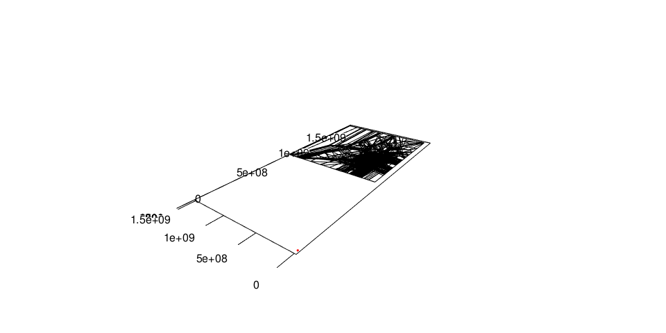
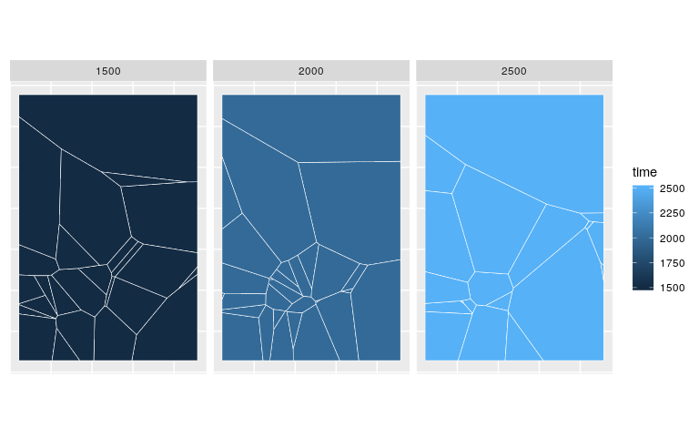
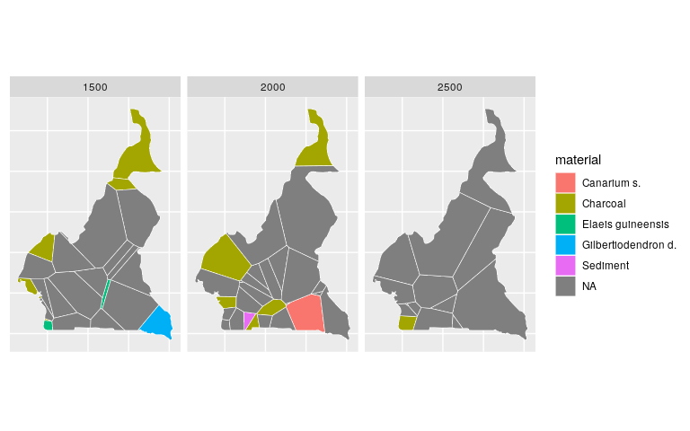

[](https://www.repostatus.org/#wip)
[](https://travis-ci.com/nevrome/bleiglas)
[](https://codecov.io/github/nevrome/bleiglas?branch=master)
[](https://cran.r-project.org/package=bleiglas)
[](https://www.r-project.org/Licenses/MIT)

<!-- README.md is generated from README.Rmd. Please edit that file -->

# bleiglas

bleiglas is an R package that provides functions for 3D tessellation
with [voro++](http://math.lbl.gov/voro++/) and subsequent horizontal
cutting of the resulting polygons for 2D plotting. It was developed for
archaeological spatiotemporal data, but may as well be used for other
three dimensional contexts.

## Documentation

1.  This README (see Quickstart guide below) describes a basic workflow
    with code and explains some of my thought process when writing this
    package
2.  A [JOSS
    paper](https://github.com/nevrome/bleiglas/blob/master/paper/paper.md)
    (not submitted yet) which gives some background, introduces the core
    functions from a more technical point of view and presents an
    example application
3.  A
    [vignette](https://github.com/nevrome/bleiglas/blob/master/vignettes/complete_example.Rmd)
    which contains all the code necessary to reproduce the example
    application in said JOSS paper

## Installation

You can install bleiglas from github

``` r
if(!require('remotes')) install.packages('remotes')
remotes::install_github("nevrome/bleiglas")
```

For the main function `tessellate` you also have to [install the voro++
software](http://math.lbl.gov/voro++/download/). For Linux users: The
package is already available in all major software repositories.

## Quickstart

For this quickstart, we assume you have packages `tidyverse`, `sf`,
`rgeos` (which in turn requires the Unix package `geos`) and `c14bazAAR`
installed.

#### Getting some data

I decided to use Dirk Seidenstickers [*Archives des datations
radiocarbone d’Afrique
centrale*](https://github.com/dirkseidensticker/aDRAC) dataset for this
purpose. It includes radiocarbon datings from Central Africa that
combine spatial (x & y) and temporal (z) position with some meta
information.

<details>

<summary>Click here for the data preparation steps</summary>

<p>

I selected dates from Cameroon between 1000 and 3000 uncalibrated BP and
projected them into a worldwide cylindrical reference system (epsg
[4088](https://epsg.io/4088)). As Cameroon is close to the equator this
projection should represent distances, angles and areas sufficiently
correct for this example exercise. As a minor pre-processing step, I
here also remove samples with equal position in all three dimensions for
the tessellation.

``` r
# download raw data
c14_cmr <- c14bazAAR::get_c14data("adrac") %>% 
  # filter data
  dplyr::filter(!is.na(lat) & !is.na(lon), c14age > 1000, c14age < 3000, country == "CMR") 
```

    ##   |                                                          |                                                  |   0%  |                                                          |++++++++++++++++++++++++++++++++++++++++++++++++++|  99%  |                                                          |++++++++++++++++++++++++++++++++++++++++++++++++++| 100%

``` r
# remove doubles
c14_cmr_unique <- c14_cmr %>%
  dplyr::mutate(
    rounded_coords_lat = round(lat, 3),
    rounded_coords_lon = round(lon, 3)
  ) %>%
  dplyr::group_by(rounded_coords_lat, rounded_coords_lon, c14age) %>%
  dplyr::filter(dplyr::row_number() == 1) %>%
  dplyr::ungroup()

# transform coordinates
coords <- data.frame(c14_cmr_unique$lon, c14_cmr_unique$lat) %>% 
  sf::st_as_sf(coords = c(1, 2), crs = 4326) %>% 
  sf::st_transform(crs = 4088) %>% 
  sf::st_coordinates()

# create active dataset
c14 <- c14_cmr_unique %>% 
  dplyr::transmute(
    id = 1:nrow(.),
    x = coords[,1], 
    y = coords[,2], 
    z = c14age,
    material = material
)
```

</p>

</details>

<details>

<summary>Data: <b>c14</b></summary>

<p>

``` r
c14 
```

    ## # A tibble: 380 x 5
    ##       id        x       y     z material
    ##    <int>    <dbl>   <dbl> <int> <chr>   
    ##  1     1 1284303. 450331.  1920 <NA>    
    ##  2     2 1284303. 450331.  2596 <NA>    
    ##  3     3 1284303. 450331.  2360 <NA>    
    ##  4     4 1284303. 450331.  2380 <NA>    
    ##  5     5 1278776. 434150.  2810 <NA>    
    ##  6     6 1278776. 434150.  2710 <NA>    
    ##  7     7 1278776. 434150.  1860 <NA>    
    ##  8     8 1278776. 434150.  1960 <NA>    
    ##  9     9 1278776. 434150.  2820 <NA>    
    ## 10    10 1278776. 434150.  2110 <NA>    
    ## # … with 370 more rows

</p>

</details>

#### 3D tessellation

[Tessellation](https://en.wikipedia.org/wiki/Tessellation) means filling
space with polygons so that neither gaps nor overlaps occur. This is an
exciting application for art (e.g. textile art or architecture) and an
interesting challenge for mathematics. As a computational archaeologist
I was already aware of one particular tessellation algorithm that has
quite some relevance for geostatistical analysis like spatial
interpolation: Voronoi tilings that are created with [Delaunay
triangulation](https://en.wikipedia.org/wiki/Delaunay_triangulation).
These are tessellations where each polygon covers the space closest to
one of a set of sample
points.

<table style="width:100%">

<tr>

<th>

<figure>


<figcaption>

Islamic mosaic with tile tessellations in Marrakech, Morocco.
<a href="https://en.wikipedia.org/wiki/File:Ceramic_Tile_Tessellations_in_Marrakech.jpg">wiki</a>

</figcaption>

</figure>

</th>

<th>

<figure>


<figcaption>

Delaunay triangulation and its Voronoi diagram.
<a href="https://commons.wikimedia.org/wiki/File:Delaunay_Voronoi.svg">wiki</a>

</figcaption>

</figure>

</th>

<th>

<figure>


<figcaption>

Output example of voro++ rendered with POV-Ray.
<a href="http://math.lbl.gov/voro++">math.lbl.gov</a>

</figcaption>

</figure>

</th>

<tr>

</table>

It turns out that Voronoi tessellation can be calculated not just for 2D
surfaces, but also for higher dimensions. The
[voro++](http://math.lbl.gov/voro++/) software library does exactly this
for 3 dimensions, such as for spatio-temporal applications.

`bleiglas::tessellate()` is a minimal wrapper function that calls the
voro++ command line interface (therefore you have to install voro++ to
use it) for datasets like the one introduced above. We can apply it like
this:

``` r
raw_voro_output <- bleiglas::tessellate(
  c14[, c("id", "x", "y", "z")],
  x_min = min(c14$x) - 150000, x_max = max(c14$x) + 150000, 
  y_min = min(c14$y) - 150000, y_max = max(c14$y) + 150000,
  unit_scaling = c(0.001, 0.001, 1)
)
```

A critical step when using tessellation for spatio-temporal data is a
suitable conversion scale between time- and spatial units. Since 3D
tessellation crucially depends on the concept of a 3D-distance, we need
to make a decision how to combine length- and time-units. Here, for the
purpose of this example, we have 1 kilometre correspond to 1 year. Since
after the coordinate conversion our spatial units are given in meters,
we divide all spatial distances by a factor 1000 to achieve this
correspondence: `unit_scaling = c(0.001, 0.001, 1)`.

I decided to increase the size of the tessellation box by 150 kilometres
to each (spatial) direction to cover the area of Cameroon. Mind that the
scaling factors in `unit_scaling` are also applied to the box size
parameters `x_min`, `x_max`, ….

The output of voro++ is highly customizable, and structurally complex.
Voro++, with the `-v` flag prints some config info on the command line,
which is also the output of
    `bleiglas::tesselate`:

    Container geometry        : [937.143:1906.88] [63.1242:1506.58] [1010:2990]
    Computational grid size   : 3 by 5 by 6 (estimated from file)
    Filename                  : /tmp/RtmpmrfjUb/file4e6b779e7830
    Output string             : %i*%P*%t
    Total imported particles  : 379 (4.2 per grid block)
    Total V. cells computed   : 379
    Total container volume    : 2.77155e+09
    Total V. cell volume      : 2.77155e+09

It then produces an output file (`*.vol`) that contains all sorts of
geometry information for the calculated 3D polygons. I focussed on the
edges of the polygons and wrote a parser function
`bleiglas::read_polygon_edges()` that can transform the complex voro++
output to a tidy data.frame with six columns: the coordinates (x, y, z)
of the start (a) and end point (b) of each polygon edge.

``` r
polygon_edges <- bleiglas::read_polygon_edges(raw_voro_output)
```

Before we use this output for any further analysis, we should reverse
the rescaling introduced with the `unit_scaling` parameter to fit to the
input data again.

``` r
polygon_edges %<>% dplyr::mutate(
  x.a = x.a * 1000,
  x.b = x.b * 1000,
  y.a = y.a * 1000,
  y.b = y.b * 1000
)
```

<details>

<summary>Data: <b>polygon\_edges</b></summary>

<p>

    ##            x.a    y.a     z.a     x.b    y.b     z.b polygon_id
    ##     1: 1352610 233681 1240.76 1381950 158990 1274.74         38
    ##     2: 1324180 130338 1292.50 1381950 158990 1274.74         38
    ##     3: 1309730 225141 1313.81 1381950 158990 1274.74         38
    ##     4: 1201420 392245 1299.83 1289680 241638 1324.36         38
    ##     5: 1276830 227624 1327.04 1289680 241638 1324.36         38
    ##    ---                                                         
    ## 24034: 1408090 992474 2655.00 1502620 926332 2717.02        272
    ## 24035: 1514160 920693 2717.02 1502620 926332 2717.02        272
    ## 24036: 1599840 898736 2655.00 1514160 920693 2717.02        272
    ## 24037: 1520780 928425 2770.00 1514160 920693 2717.02        272
    ## 24038: 1502620 926332 2717.02 1514160 920693 2717.02        272

</p>

</details>

<details>

<summary>We can plot these polygon edges (black) together with the input
sample points (red) in 3D.</summary>

<p>

``` r
rgl::axes3d()
rgl::points3d(c14$x, c14$y, c14$z, color = "red")
rgl::aspect3d(1, 1, 1)
rgl::segments3d(
  x = as.vector(t(polygon_edges[,c(1,4)])),
  y = as.vector(t(polygon_edges[,c(2,5)])),
  z = as.vector(t(polygon_edges[,c(3,6)]))
)
rgl::view3d(userMatrix = view_matrix, zoom = 0.9)
```

</p>

</details>



#### Cutting the polygons

This 3D plot, even if rotatable using mouse input, is of rather limited
value since it’s very hard to read. I therefore wrote
`bleiglas::cut_polygons()` that can cut the 3D polygons at different
levels of the z-axis. As the function assumes that x and y represent
geographic coordinates, the cuts produce sets of spatial 2D polygons for
different values of z – in our example different points in time. The
parameter `cuts` takes a numeric vector of cutting points on the z axis.
`bleiglas::cut_polygons()` yields a rather raw format for specifying
polygons. Another function, `bleiglas::cut_polygons_to_sf()`, transforms
it to `sf`. Here `crs` defines the spatial coordinate reference system
of x and y to project the resulting 2D polygons correctly.

``` r
cut_surfaces <- bleiglas::cut_polygons(
  polygon_edges, 
  cuts = c(2500, 2000, 1500)
) %>%
  bleiglas::cut_polygons_to_sf(crs = 4088)
```

<details>

<summary>Data: <b>cut\_surfaces</b></summary>

<p>

    ## Simple feature collection with 74 features and 2 fields
    ## geometry type:  POLYGON
    ## dimension:      XY
    ## bbox:           xmin: 937143 ymin: 63124.2 xmax: 1906880 ymax: 1506580
    ## projected CRS:  World Equidistant Cylindrical (Sphere)
    ## First 10 features:
    ##                                 x    z  id
    ## 1  POLYGON ((1195186 319422.3,... 2500  16
    ## 2  POLYGON ((1906880 811490.3,... 2500  44
    ## 3  POLYGON ((1146789 374017.9,... 2500  51
    ## 4  POLYGON ((1215920 365182.3,... 2500  53
    ## 5  POLYGON ((1416023 455769.2,... 2500  82
    ## 6  POLYGON ((1082637 969464, 9... 2500 102
    ## 7  POLYGON ((1906880 63124.2, ... 2500 104
    ## 8  POLYGON ((1386791 333246.8,... 2500 134
    ## 9  POLYGON ((1116403 63124.2, ... 2500 143
    ## 10 POLYGON ((1371502 63124.2, ... 2500 186

</p>

</details>

<details>

<summary>With this data we can plot a matrix of maps that show the cut
surfaces.</summary>

<p>

``` r
cut_surfaces %>%
  ggplot() +
  geom_sf(
    aes(fill = z), 
    color = "white",
    lwd = 0.2
  ) +
  geom_sf_text(aes(label = id)) +
  facet_wrap(~z) +
  theme(
    axis.text = element_blank(),
    axis.ticks = element_blank()
  )
```

</p>

</details>



<details>

<summary>As all input dates come from Cameroon it makes sense to cut the
polygon surfaces to the outline of this administrative
unit.</summary>

<p>

``` r
cameroon_border <- rnaturalearth::ne_countries(scale = "medium", returnclass = "sf") %>% 
  dplyr::filter(name == "Cameroon") %>% 
  sf::st_transform(4088)

cut_surfaces_cropped <- cut_surfaces %>% sf::st_intersection(cameroon_border)
```

``` r
cut_surfaces_cropped %>%
  ggplot() +
  geom_sf(
    aes(fill = z), 
    color = "white",
    lwd = 0.2
  ) +
  facet_wrap(~z) +
  theme(
    axis.text = element_blank(),
    axis.ticks = element_blank()
  )
```

<p>

</details>


<details>

<summary>Finally, we can also visualise any point-wise information in
our input data as a feature of the tessellation polygons.</summary>

<p>

``` r
cut_surfaces_material <- cut_surfaces_cropped %>%
  dplyr::left_join(
    c14, by = "id"
  )
```

``` r
cut_surfaces_material %>%
  ggplot() +
  geom_sf(
    aes(fill = material), 
    color = "white",
    lwd = 0.2
  ) +
  facet_wrap(~z.x) +
  theme(
    axis.text = element_blank(),
    axis.ticks = element_blank()
  )
```

</p>

</details>



This quickstart was a simple primer on how to use this package. If you
think the final use case wasn’t too impressive, take a look at this
analysis of Bronze Age burial types through time, as performed in our
[JOSS
paper](https://github.com/nevrome/bleiglas/blob/master/paper/paper.md)
and the
[vignette](https://github.com/nevrome/bleiglas/blob/master/vignettes/complete_example.Rmd).

<!-- Add JOSS paper figure here? Just a suggestion as a further teaser. It's just beautiful -->

## Citation

    ## 
    ## To cite package 'bleiglas' in publications use:
    ## 
    ##   Clemens Schmid (2020). bleiglas: 3D Tessellation with Voro++. R
    ##   package version 0.0.0.9000. https://github.com/nevrome/bleiglas
    ## 
    ## A BibTeX entry for LaTeX users is
    ## 
    ##   @Manual{,
    ##     title = {bleiglas: 3D Tessellation with Voro++},
    ##     author = {Clemens Schmid},
    ##     year = {2020},
    ##     note = {R package version 0.0.0.9000},
    ##     url = {https://github.com/nevrome/bleiglas},
    ##   }
