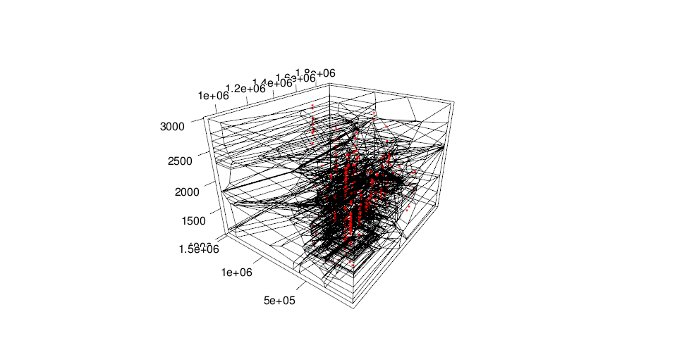
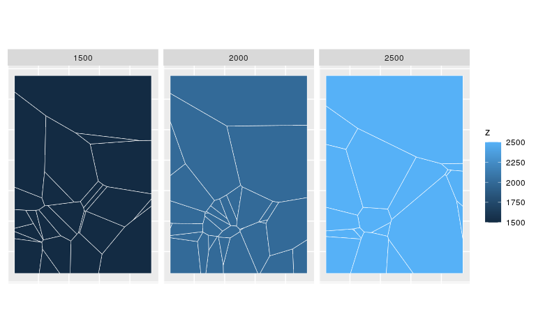
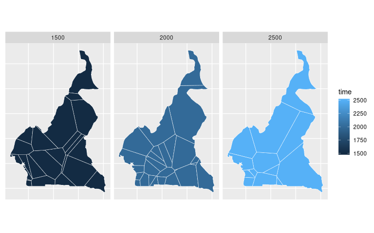
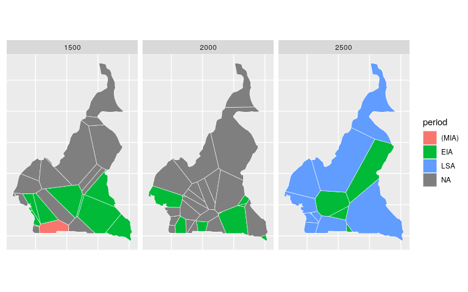

<!-- README.md is generated from README.Rmd. Please edit that file -->

# bleiglas

bleiglas is an R package that provides some helper functions for 3D
tessellation and subsequent cutting of the resulting polygons along one
dimension for plotting. The workflow is described below:

### Get some data

Let’s get some data in three dimension with an arbitrary sample
variable. I decided to use @dirkseidenstickers *Archives des datations
radiocarbone d’Afrique centrale* dataset for this purpose. It includes
radiocarbon datings from Central Africa that combine spatial (x & y) and
temporal (z) information.

<details>

<summary>Click here for details of data preparation</summary>

<p>

I selected dates from Cameroon between 1000 and 3000 uncalibrated BP,
projected them on a simple cylindrical projection (epsg 4088). Cameroon
is so close to the equator, that this projection should even represent
distances, angles and areas quite correctly. I rescaled the temporal
data with a factor of 1000 to better show the effect of 3D tessellation.
You can imagine the samples to be observations in a 3D geo-time-space
where one year equals one kilometre.

``` r
c14_cmr <- c14bazAAR::get_c14data("adrac") %>% 
  dplyr::filter(!is.na(lat) & !is.na(lon), c14age > 1000, c14age < 3000, country == "CMR")
```

    ## 
      |                                                        
      |                                                  |   0%
      |                                                        
      |++++++++++++++++++++++++++++++++++++++++++++++++++|  99%
      |                                                        
      |++++++++++++++++++++++++++++++++++++++++++++++++++| 100%

``` r
coords <- data.frame(c14_cmr$lon, c14_cmr$lat) %>% 
  sf::st_as_sf(coords = c(1, 2), crs = 4326) %>% 
  sf::st_transform(crs = 4088) %>% 
  sf::st_coordinates()

c14 <- c14_cmr %>% 
  dplyr::transmute(
    id = 1:nrow(.),
    x = coords[,1], 
    y = coords[,2], 
    z = c14age * 1000, # rescaling of temporal data
    material = material
)
```

</p>

</details>

<details>

<summary>Data: <b>c14</b></summary>

<p>

``` r
c14 
```

    ##  Radiocarbon date list
    ##  dates       405 
    ## 
    ## # A tibble: 405 x 5
    ##       id        x       y       z material
    ##    <int>    <dbl>   <dbl>   <dbl> <chr>   
    ##  1     1 1284303. 450331. 1920000 <NA>    
    ##  2     2 1284303. 450331. 2596000 <NA>    
    ##  3     3 1284303. 450331. 2360000 <NA>    
    ##  4     4 1284303. 450331. 2380000 <NA>    
    ##  5     5 1278776. 434150. 2810000 <NA>    
    ##  6     6 1278776. 434150. 2710000 <NA>    
    ##  7     7 1278776. 434150. 1860000 <NA>    
    ##  8     8 1278776. 434150. 1960000 <NA>    
    ##  9     9 1278776. 434150. 2820000 <NA>    
    ## 10    10 1278776. 434150. 2110000 <NA>    
    ## # … with 395 more rows

</p>

</details>

### 3D tessellation

[Tessellation](https://en.wikipedia.org/wiki/Tessellation) means filling
space with polygons so that neither gaps nor overlaps occur. This is an
exciting application for art (e.g. textile art or architecture) and an
interesting challenge for mathematics. As a computational archaeologist
I know one particular tessellation algorithm that has quiet some
relevance for geostatistical operations like e.g. spatial interpolation:
Voronoi tilings as produced with [Delaunay
triangulation](https://en.wikipedia.org/wiki/Delaunay_triangulation).
These are tessellations where each polygon covers the space closest to
one of a set of sample points.

<table style="width:100%">

<tr>

<th>

<figure>


<figcaption>

Islamic mosaic with tile tessellations in Marrakech, Morocco.
<a href="https://en.wikipedia.org/wiki/File:Ceramic_Tile_Tessellations_in_Marrakech.jpg">wiki</a>

</figcaption>

</figure>

</th>

<th>

<figure>


<figcaption>

Delaunay triangulation and its Voronoi diagram.
<a href="https://commons.wikimedia.org/wiki/File:Delaunay_Voronoi.svg">wiki</a>

</figcaption>

</figure>

</th>

<th>

<figure>


<figcaption>

Output example of voro++ rendered with POV-Ray.
<a href="http://math.lbl.gov/voro++">math.lbl.gov</a>

</figcaption>

</figure>

</th>

<tr>

</table>

Voronoi tessellation can be calculated not just for 2D surfaces, but
also for higher dimensions. The [voro++](http://math.lbl.gov/voro++/)
software library does exactly this for 3D space.
`bleiglas::tessellate()` is a very minimal wrapper function that calls
the voro++ command line interface for datasets like the one introduced
above.

``` r
raw_voro_output <- bleiglas::tessellate(c14[, c("id", "x", "y", "z")])
```

voro++ prints some config info on the command line:

    Container geometry        : [213124:1.35658e+06] [1.08714e+06:1.75688e+06] [1.01e+06:2.99e+06]
    Computational grid size   : 5 by 3 by 8 (estimated from file)
    Filename                  : /tmp/Rtmpcqs4Vq/file...
    Output string             : %i§%P§%t
    Total imported particles  : 399 (3.3 per grid block)
    Total V. cells computed   : 353
    Total container volume    : 1.51632e+18
    Total V. cell volume      : 1.40304e+18

The output of voro++ is highly customizable, but structurally complex. I
focussed on the edges of the resulting 3D polygons and wrote a parser
function `bleiglas::read_polygon_edges()` that can transform it to a
tidy data.frame with the coordinates (x, y, z) of the start (a) and end
point (b) of each polygon edge.

``` r
polygon_edges <- bleiglas::read_polygon_edges(raw_voro_output)
```

<details>

<summary>Data</summary>

<p>

    ## # A tibble: 22,012 x 7
    ##        x.a    y.a     z.a     x.b    y.b     z.b    id
    ##      <dbl>  <dbl>   <dbl>   <dbl>  <dbl>   <dbl> <dbl>
    ##  1 1334410 213124 1010000 1087140 213124 1010000    43
    ##  2 1087140 335336 1010000 1087140 213124 1010000    43
    ##  3 1087140 213124 1121520 1087140 213124 1010000    43
    ##  4 1087140 213124 1010000 1334410 213124 1010000    43
    ##  5 1213480 327271 1010000 1334410 213124 1010000    43
    ##  6 1345420 213124 1045070 1334410 213124 1010000    43
    ##  7 1087140 213124 1121520 1352900 213124 1183750    43
    ##  8 1345420 213124 1045070 1352900 213124 1183750    43
    ##  9 1352160 215243 1183610 1352900 213124 1183750    43
    ## 10 1087140 213124 1010000 1087140 335336 1010000    43
    ## # … with 22,002 more rows

</p>

</details>

<details>

<summary>We can plot these polygon edges (black) together with the input
sample points (red) in 3D. Before we do that, we can change the scaling
of the temporal information again to increase the readability of the
plot.</summary>

<p>

``` r
polygon_edges %<>% dplyr::mutate(
  z.a = z.a / 1000,
  z.b = z.b / 1000
)

c14 %<>% dplyr::mutate(
  z = z / 1000
)
```

``` r
rgl::axes3d()
rgl::points3d(c14$x, c14$y, c14$z, color = "red")
rgl::aspect3d(1, 1, 1)
rgl::segments3d(
  x = as.vector(t(polygon_edges[,c(1,4)])),
  y = as.vector(t(polygon_edges[,c(2,5)])),
  z = as.vector(t(polygon_edges[,c(3,6)]))
)
rgl::view3d(userMatrix = view_matrix, zoom = 0.9)
```

</p>

</details>



### Cutting the polygons

The static 3D plot is of rather dubious value for understanding the
tessellation. I therefore introduce the function
`bleiglas::cut_polygons()` that can cut the 3D polygons at different
levels of the z-axis. The function assumes x and y represent
geographical coordinates. The cuts therefore produce sets of spatial 2D
polygons at different values of z – in our example different points in
time. The parameter `cuts` takes a numeric vector of cutting points,
`crs` defines the spatial coordinate reference system of x and y to
project the resulting 2D polygons correctly.

``` r
cut_surfaces <- bleiglas::cut_polygons(
  polygon_edges, 
  cuts = c(2500, 2000, 1500), 
  crs = 4088
)
```

<details>

<summary>Data</summary>

<p>

    ## Simple feature collection with 63 features and 2 fields
    ## geometry type:  POLYGON
    ## dimension:      XY
    ## bbox:           xmin: 1087140 ymin: 213124 xmax: 1756880 ymax: 1356580
    ## epsg (SRID):    4088
    ## proj4string:    +proj=eqc +lat_ts=0 +lat_0=0 +lon_0=0 +x_0=0 +y_0=0 +R=6371007 +units=m +no_defs
    ## First 10 features:
    ##    time  id                       geometry
    ## 1  2500  16 POLYGON ((1193932 315609.9,...
    ## 2  2500  54 POLYGON ((1146789 374017.9,...
    ## 3  2500  56 POLYGON ((1146789 374017.9,...
    ## 4  2500  85 POLYGON ((1416023 455769.2,...
    ## 5  2500 106 POLYGON ((1157246 1126940, ...
    ## 6  2500 108 POLYGON ((1389740 324622.2,...
    ## 7  2500 141 POLYGON ((1386791 333246.8,...
    ## 8  2500 151 POLYGON ((1162469 213124, 1...
    ## 9  2500 195 POLYGON ((1381969 213124, 1...
    ## 10 2500 279 POLYGON ((1167769 487267.6,...

</p>

</details>

<details>

<summary>With this data we can plot a matrix of maps that show the cut
surfaces.</summary>

<p>

``` r
cut_surfaces %>%
  ggplot() +
  geom_sf(
    aes(fill = time), 
    color = "white",
    lwd = 0.2
  ) +
  facet_wrap(~time) +
  theme(
    axis.text = element_blank(),
    axis.ticks = element_blank()
  )
```

</p>

</details>



<details>

<summary>As all input dates come from Cameroon it might be a sensible
decision to cut the polygon surfaces to the outline of this
administrative, spatial unit.</summary>

<p>

``` r
cameroon_border <- rnaturalearth::ne_countries(scale = "medium", returnclass = "sf") %>% 
  dplyr::filter(name_en == "Cameroon") %>% 
  sf::st_transform(4088)

cut_surfaces_cropped <- cut_surfaces %>% sf::st_intersection(cameroon_border)
```

``` r
cut_surfaces_cropped %>%
  ggplot() +
  geom_sf(
    aes(fill = time), 
    color = "white",
    lwd = 0.2
  ) +
  facet_wrap(~time) +
  theme(
    axis.text = element_blank(),
    axis.ticks = element_blank()
  )
```

<p>

</details>



<details>

<summary>Of course we can visualise any point-wise information we
initially had as a feature of the tessellation polygons.</summary>

<p>

``` r
cut_surfaces_material <- cut_surfaces_cropped %>%
  dplyr::left_join(
    c14, by = "id"
  )
```

``` r
cut_surfaces_material %>%
  ggplot() +
  geom_sf(
    aes(fill = material), 
    color = "white",
    lwd = 0.2
  ) +
  facet_wrap(~time) +
  theme(
    axis.text = element_blank(),
    axis.ticks = element_blank()
  )
```

</p>

</details>


