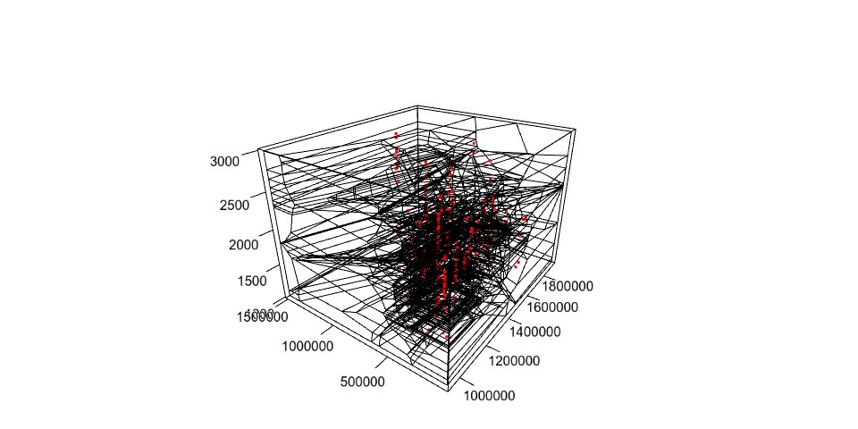

<!-- README.md is generated from README.Rmd. Please edit that file -->

# bleiglas

bleiglas is an R package that provides some helper functions for 3D
tessellation and subsequent cutting of the resulting polygons along one
dimension for plotting. The workflow is described below:

### Get some data

Let’s get some data in three dimension with an arbitrary sample
variable. I decided to use @dirkseidenstickers *Archives des datations
radiocarbone d’Afrique centrale* dataset for this purpose. It includes
radiocarbon datings from Central Africa that combine spatial (x & y) and
temporal (z) information.

<details>

<summary>Click here for details of data preparation</summary>

<p>

``` r
c14_cmr <- c14bazAAR::get_c14data("adrac") %>% 
  dplyr::filter(!is.na(lat) & !is.na(lon), c14age > 1000, c14age < 3000, country == "CMR")
```

    ## 
      |                                                        
      |                                                  |   0%
      |                                                        
      |++++++++++++++++++++++++++++++++++++++++++++++++++|  99%
      |                                                        
      |++++++++++++++++++++++++++++++++++++++++++++++++++| 100%

``` r
coords <- data.frame(c14_cmr$lat, c14_cmr$lon) %>% 
  sf::st_as_sf(coords = c(1, 2), crs = 4326) %>% 
  sf::st_transform(crs = 4088) %>% 
  sf::st_coordinates()

c14 <- c14_cmr %>% 
  dplyr::transmute(
    id = 1:nrow(.),
    x = coords[,1], 
    y = coords[,2], 
    z = c14age * 1000 # rescaling of temporal data
)
```

</p>

</details>

<br>

I selected dates from Cameroon between 1000 and 3000 uncalibrated BP,
projected them on a simple cylindrical projection. Cameroon is so close
to the equator, that this projection should even represent distances,
angles and areas quite correctly. I rescaled the temporal data with a
factor of 1000 to better show the effect of 3D tessellation. You can
imagine the samples to be observations in a 3D geo-time-space where one
year equals one kilometre.

``` r
c14 
```

    ##  Radiocarbon date list
    ##  dates       405 
    ## 
    ## # A tibble: 405 x 4
    ##       id       x        y       z
    ##    <int>   <dbl>    <dbl>   <dbl>
    ##  1     1 450331. 1284303. 1920000
    ##  2     2 450331. 1284303. 2596000
    ##  3     3 450331. 1284303. 2360000
    ##  4     4 450331. 1284303. 2380000
    ##  5     5 434150. 1278776. 2810000
    ##  6     6 434150. 1278776. 2710000
    ##  7     7 434150. 1278776. 1860000
    ##  8     8 434150. 1278776. 1960000
    ##  9     9 434150. 1278776. 2820000
    ## 10    10 434150. 1278776. 2110000
    ## # … with 395 more rows

### 3D tessellation

[Tessellation](https://en.wikipedia.org/wiki/Tessellation) means filling
space with polygons so that neither gaps and nor overlaps occur. This is
an exciting application for art (e.g. textile art or architecture) and
an interesting challenge for mathematics. As a computational
archaeologist I know one particular tessellation algorithm that has
quiet some relevance for geostatistical operations like e.g. spatial
interpolation: Voronoi tilings as produced with [Delaunay
triangulation](https://en.wikipedia.org/wiki/Delaunay_triangulation).
These are tessellations where each polygon covers the space closest to
one of a set of sample points.

<table style="width:100%">

<tr>

<th>

<figure>


<figcaption>

Islamic mosaic with tile tessellations in Marrakech, Morocco.
<a href="https://en.wikipedia.org/wiki/File:Ceramic_Tile_Tessellations_in_Marrakech.jpg">wiki</a>

</figcaption>

</figure>

</th>

<th>

<figure>


<figcaption>

Delaunay triangulation and its Voronoi diagram.
<a href="https://commons.wikimedia.org/wiki/File:Delaunay_Voronoi.svg">wiki</a>

</figcaption>

</figure>

</th>

<th>

<figure>


<figcaption>

Output example of voro++ rendered with POV-Ray.
<a href="http://math.lbl.gov/voro++">math.lbl.gov</a>

</figcaption>

</figure>

</th>

<tr>

</table>

Voronoi tessellation can be calculated not just for 2D surfaces, but
also for higher dimensions. The [voro++](http://math.lbl.gov/voro++/)
software library does exactly this for 3D space.
`bleiglas::tessellate()` is a very minimal wrapper function that calls
voro++ for datasets like the one introduced above.

``` r
raw_voro_output <- bleiglas::tessellate(c14[, c("id", "x", "y", "z")])
```

Read voro++ output

``` r
polygon_edges <- bleiglas::read_polygon_edges(raw_voro_output)
```

plot edges and data

``` r
polygon_edges %<>% dplyr::mutate(
  z.a = z.a / 1000,
  z.b = z.b / 1000
)

c14 %<>% dplyr::mutate(
  z = z / 1000
)
```

3d plot with sample points and polygons

``` r
rgl::axes3d()
rgl::points3d(c14$x, c14$y, c14$z, color = "red")
rgl::aspect3d(1, 1, 1)
rgl::segments3d(
  x = as.vector(t(polygon_edges[,c(1,4)])),
  y = as.vector(t(polygon_edges[,c(2,5)])),
  z = as.vector(t(polygon_edges[,c(3,6)]))
)
```

<!-- -->

``` r
cut_surfaces <- bleiglas::cut_polygons(polygon_edges, c(2500, 2000, 1500), crs = 4088)
```

``` r
cut_surfaces %>%
  ggplot() +
  geom_sf(
    aes(fill = time), 
    color = "white",
    lwd = 0.2
  ) +
  facet_wrap(~time) +
  theme_bw() +
  theme(
    axis.text = element_blank(),
    axis.ticks = element_blank()
  )
```

<!-- -->
